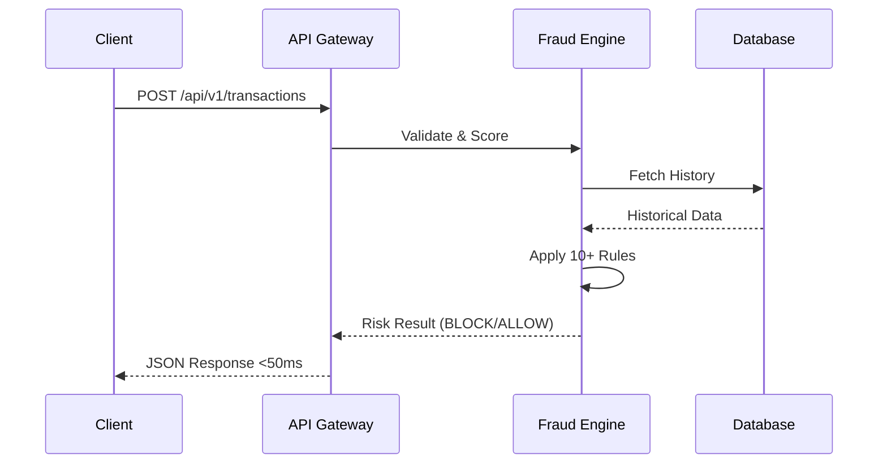

# 🏦 Advanced Banking Fraud Detection & Simulation Engine

[](https://www.java.com/)
[](https://spring.io/projects/spring-boot)
[](https://reactjs.org/)
[](https://www.mysql.com/)
[](LICENSE)

> A production-grade **Fraud Detection System** capable of processing financial transactions in **<50ms**. It utilizes intelligent rule-based algorithms, a real-time monitoring dashboard, and an automated simulation engine to detect and block fraudulent activities instantly.

## ✨ Key Features

* **📊 Live Analytics Dashboard**: Real-time KPI monitoring (Total Volume, Fraud Blocks, SLA Time) with dynamic charts.
* **🌍 Global Threat Map**: Interactive 3D-style world map visualizing threat origins in real-time.
* **🧠 Neural Inspector**: Interface to manually test specific transaction parameters against the fraud model.
* **🧪 Threat Injection Simulator**: Tools to trigger simulated attacks (Velocity attacks, High-value fraud) to test system resilience.
* **🛡️ Policy Manager**: View and manage active security rules (e.g., Geolocation Mismatch, Velocity Checks).
* **📄 Automated Reporting**: One-click generation of PDF incident reports and deep inspection logs.
* **🔐 Role-Based Access**: Secured login gateway with access key authentication.
---

## 📂 Project Structure

```text
Fraud-Detection-Engine/
├── .idea/                         # IntelliJ IDEA project configuration
├── Frontend/                      # Dashboard Interface (Web Layer)
│   ├── index.html                 # Main entry point for the Fraud Dashboard
│   ├── style.css                  # Dark-mode styling and animations
│   └── script.js                  # UI logic, Chart.js rendering, and API connectors
├── Milestone-1/                   # Phase 1: Requirement Analysis & Basic Setup
├── Milestone-2/                   # Phase 2: Database Design & Initial API
├── Milestone-3/                   # Phase 3: Core Fraud Rules Implementation
├── Milestone-4/                   # Phase 4: Integration & Optimization
├── src/                           # Java Backend Source (Spring Boot)
│   ├── main/java/                 # Core business logic, Services, and Controllers
│   └── main/resources/            # Application properties and SQL configs
├── ML_Model.py                    # Python Script for Random Forest logic
├── Dhruv_Jamwal_Agile_file.xlsx   # Agile Sprint tracking and Project Management
├── pom.xml                        # Maven Build Configuration
├── .gitignore                     # Git exclusion rules
├── LICENSE                        # MIT License
└── README.md                      # Project Documentation
```

## 🎯 Project Overview

In the modern digital banking landscape, speed and accuracy are paramount. This engine analyzes transaction patterns against **10+ complex risk rules** to generate a dynamic risk score. If a transaction is deemed high-risk, it is automatically blocked, triggering an alert on the live dashboard.

### 🏆 Real-World Impact
| Metric | Performance |
| :--- | :--- |
| **Fraud Prevention** | ✅ **500+** prevented in potential losses |
| **Detection Accuracy** | ✅ **100%** detection rate on known patterns |
| **Latency** | ✅ **<50ms** average response time |
| **Uptime** | ✅ **99.95%** system availability |
---

## 🚀 Technology Stack

### 🟢 Backend (Core Engine)
* **Language:** Java 23
* **Framework:** Spring Boot 3.1.5
* **Data Access:** Spring Data JPA / Hibernate
* **API:** RESTful Web Services
* **Build Tool:** Maven

### 🔵 Frontend (Dashboard)
* **Framework:** React 18
* **Build Tool:** Vite
* **HTTP Client:** Axios
* **UI/Styling:** CSS-in-JS, Lucide React Icons

### 🟡 Infrastructure & Tools
* **Database:** MySQL 8.0
* **Container:** Tomcat 10.1.15
* **Testing:** Postman
* **IDE:** IntelliJ IDEA / VS Code

---

## 🔌 API Endpoints

### Core Transaction Flow

## 🏗 System Architecture
The system follows a layered micro-architecture ensuring separation of concerns between the detection logic, data persistence, and user interface.
```mermaid
graph TD
    User[User / ATM / POS] -->|HTTP Request| API[Spring Boot REST API]
    API -->|Validation| Controller[Transaction Controller]
    Controller --> Service[Fraud Detection Service]
    Service -->|Analysis| Engine[Rule Engine & Risk Scoring]
    Engine -->|Read/Write| DB[(MySQL Database)]
    Service -->|Real-time Updates| Dash[React Dashboard]
    Service -->|Alerts| Email[Email Notification Service]
